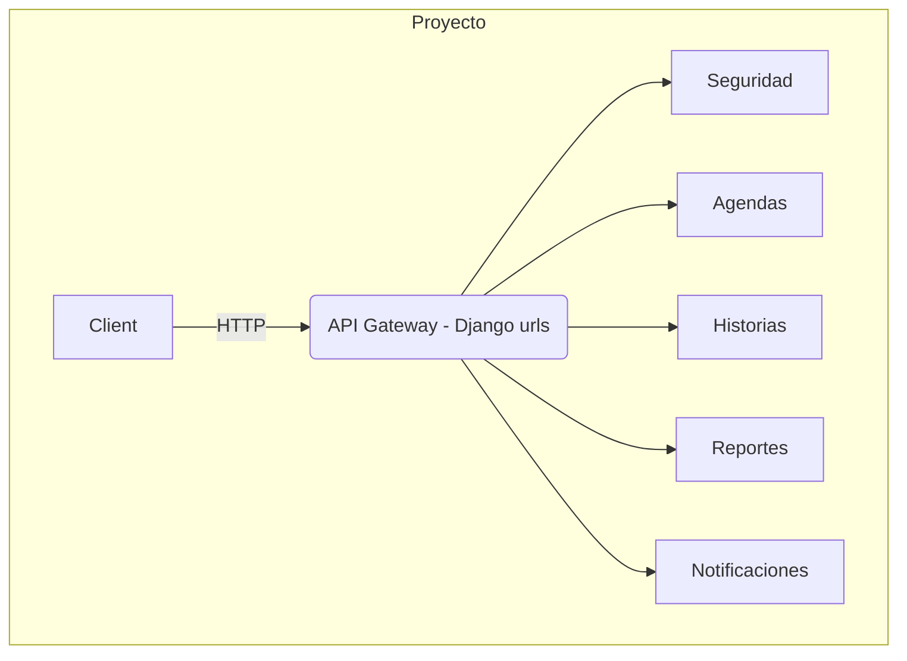
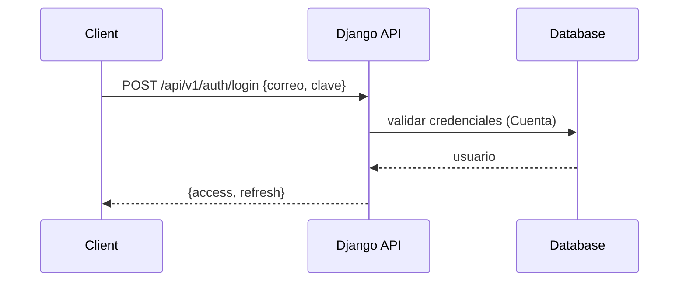
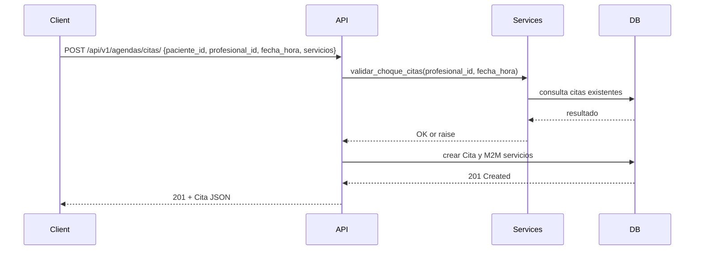

<div align="center">

# Integrantes

Douglas Carreño

Viviana Córdova

Arelys Ajila

Fabricio Ruiz

Jasiel Quezada

</div>

# Descripción general del proyecto

Este documento ofrece una descripción técnica completa de la API REST del proyecto "Historias Clínicas". Está orientado a desarrolladores, arquitectos y responsables de integración.

- Objetivo: Proveer una plataforma backend para la gestión de citas (Agendas), historias clínicas (Historias), usuarios y permisos (Seguridad), reportes (Reportes) y notificaciones (Notificaciones).

- Problema que resuelve: centralizar la gestión clínica (citas, atenciones, historias y notificaciones) con control de acceso por roles y una API REST consumible por clientes (web/móvil).

- Arquitectura: Monorepo Django con aplicaciones Django por dominio (apps): `Seguridad`, `Agendas`, `Historias`, `Reportes`, `Notificaciones`. Se usa Django REST Framework (DRF) y SimpleJWT para autenticación.

- Tecnologías: Python, Django, Django REST Framework, SimpleJWT, SQLite (archivo `db.sqlite3` en el repo), Quarto para documentación.

- Patrones: Separación por capas (models → serializers → services → views → urls). Uso de una capa de `services.py` para lógica de negocio para mantener views delgadas.

- Comunicación entre módulos: apps se importan entre sí mediante referencias a modelos (p. ej. `ForeignKey('Agendas.Servicio')`). Las URLs principales se montan desde `HistoriasClinicas/urls.py` e incluyen los routers de cada app.

# Estructura del proyecto

Estructura relevante (resumen):

- `HistoriasClinicas/` — proyecto Django (settings, urls, wsgi, asgi).

- `Agendas/` — citas, servicios, derivaciones, certificados. Contiene `models.py`, `serializers.py`, `views.py`, `services.py`, `urls.py`, `tests.py`.

- `Seguridad/` — gestión de cuentas y roles, autenticación. Contiene modelo `Cuenta` (AUTH_USER_MODEL), `serializers.py`, `views.py`, `services.py`, `permissions.py`, `urls.py`.

- `Historias/` — historias clínicas, casos, documentos.

- `Reportes/` — modelo `Reporte`, vistas de estadística y servicios para generar datos.

- `Notificaciones/` — modelo `Notificacion`, vistas para crear/leer/marcar notificaciones.

## Responsabilidad de capas

- `models.py`: definición de entidades y relaciones.

- `serializers.py`: contratos de entrada/salida y validaciones de API.

- `services.py`: lógica de negocio reutilizable (validaciones complejas, generación de tokens, agregaciones).

- `views.py`: endpoints (ViewSets, APIViews) que usan serializers y services.

- `urls.py`: definición de rutas y registro de routers.

- `tests.py`: pruebas unitarias y de API.

## Flujo de una petición HTTP

1. Request llega a `HistoriasClinicas/urls.py` y se enruta al `include()` correspondiente (p. ej. `api/v1/agendas/`).

2. El router de `Agendas.urls` (DefaultRouter) resuelve el viewset o la función view.

3. La view utiliza `authentication_classes` (JWT) y `permission_classes` para autorizar.

4. Si procede, la view invoca un `serializer` para validar/serializar datos.

5. La view llama a `services.py` si hay lógica de negocio compleja.

6. DB: ORM (models) ejecuta queries; resultados se serializan y se devuelve `Response`.

# Documentación completa de la API (por módulo)

Nota: la información indicada procede del análisis estático del código en el repositorio. Donde no hay ejemplos de respuestas reales, se indica explícitamente.

## Seguridad

Archivo principal: `C:\Users\Are\Desktop\Historias-Clinicas\HistoriasClinicas\Seguridad\views.py`

### Endpoints detectados

- Registro de usuario
  - Método: POST
  - URL: `/api/v1/auth/register` (según `Seguridad/urls.py`)
  - Descripción: registra una nueva cuenta. Usa `RegistroSerializer`.
  - Body (según `RegistroSerializer`):
    - `correo` (email) — obligatorio
    - `clave` (password) — obligatorio, min_length=8
    - `nombre`, `apellido`, `cedula` — campos opcionales/según serializer
  - ### Lógica interna crea `Cuenta` utilizando `CuentaManager` y llama a `generar_tokens` en `services.py`.
  - Respuestas esperadas: 201 con tokens en JSON; 400 en caso de validación.

- Login / Token
  - Método: POST
  - URL: `/api/v1/auth/login` (y endpoints JWT estándar `/api/token/` y `/api/token/refresh/` montados en root)
  - Descripción: obtiene tokens JWT. Implementado con `TokenObtainPairView` y vistas propias.
  - Body: credenciales (correo/clave) — ver `Seguridad.serializers`.
  - Respuestas: 200 con `access` y `refresh`.

- Gestión de usuarios (list, detail)
  - `GET /api/v1/auth/users` — lista de usuarios
  - `GET /api/v1/auth/users/{user_id}` — detalle de usuario
  - Permisos: restringidos por `HasRole` y roles definidos en `Seguridad.permissions`.

### Códigos HTTP generales

- 200 OK: peticiones GET o POST exitosas que devuelven recursos o tokens.

- 201 Created: registro exitoso.

- 400 Bad ### Request errores de validación del serializer.

- 401 Unauthorized: credenciales inválidas o token ausente/expirado.

- 403 Forbidden: usuario autenticado pero sin permisos.

## Agendas

Archivos: `Agendas/models.py`, `Agendas/serializers.py`, `Agendas/views.py`, `Agendas/services.py`, `Agendas/urls.py`.

### Modelos clave

- `Servicio` — servicios clínicos (p. ej. Odontología, Psicología).

- `Cita` — campos: `paciente_id` (Integer), `profesional_id` (Integer), `fecha_hora` (DateTime), `estado`, `motivo`, `servicios` (ManyToMany a `Servicio`).

### Endpoints

- `GET, POST /api/v1/agendas/citas/` — listar/crear citas.
  - Body (create): `paciente_id`, `profesional_id`, `fecha_hora` (iso), `motivo`, `servicios` (lista de ids)
  - Validaciones: `services.validar_choque_citas` verifica que `fecha_hora` sea futura y sin choque de horarios.

- `PATCH/PUT/DELETE /api/v1/agendas/citas/{id}/` — actualizar/eliminar.

- `GET /api/v1/agendas/servicios/` — CRUD de servicios.

- Endpoint especial `POST /api/v1/agendas/atenciones/` mapeado a `AtencionViewSet.create` (registra una atencion integral, invoca `services.registrar_atencion_integral`).

Respuestas y códigos: 201 en creación de cita, 400 si choque o fecha inválida, 404 si no existe.

## Historias

Archivos: `Historias/models.py`, `Historias/serializers.py`, `Historias/views.py`, `Historias/urls.py`.

Descripción: gestión de `HistoriaClinica` y `Caso`.

### Endpoints principales

- `GET, POST /api/v1/historias/historias_clinicas/`

- `GET, PATCH /api/v1/historias/casos/`

Validaciones: `serializers` imponen choices y constraints.

## Reportes

Archivos: `Reportes/models.py`, `Reportes/serializers.py`, `Reportes/views.py`, `Reportes/services.py`, `Reportes/urls.py`.

### Modelo principal `Reporte` con `titulo`, `tipo`, `fecha_inicio`, `fecha_fin`, `servicio` (FK a `Agendas.Servicio`) y `profesional` (FK a `Seguridad.Cuenta`).

### Endpoints detectados

- `GET, POST /api/v1/reportes/` — listar/crear reportes

- `GET /api/v1/reportes/{pk}/` — detalle

- Estadísticas:
  - `GET /api/v1/reportes/atenciones/` — estadísticas de atenciones (fecha_inicio, fecha_fin, servicio opcional)
  - `GET /api/v1/reportes/estadisticas/` — estadísticas agregadas
  - `GET /api/v1/reportes/diagnosticos-frecuentes/` — diagnósticos más frecuentes
  - `GET /api/v1/reportes/servicios-mas-usados/` — servicios más usados

Notas:

- En la sesión previa se implementaron (en `Reportes/views.py`) consultas reales que filtran por `cita__fecha_hora__date` entre `fecha_inicio` y `fecha_fin` y hacen counts sobre los modelos de consultas (medica, psicologica, odontologica, social), usando `select_related`/`prefetch_related`.

- `Reportes/services.py` contiene una clase `Services.generar_datos(reporte)` que retorna JSON con totales y desglose por subespecialidad. No se mutó `Reportes/models.py` ni `Reportes/services.py` en el análisis.

## Notificaciones

Archivos: `Notificaciones/models.py`, `Notificaciones/serializers.py`, `Notificaciones/views.py`, `Notificaciones/services.py`, `Notificaciones/urls.py`.

### Modelo Notificacion

- Campos importantes:
  - `usuario_destinatario` — FK a `Seguridad.Cuenta` (related_name='notificaciones_recibidas')
  - `cita` — FK a `Agendas.Cita`, `null=True, blank=True`
  - `tipo`, `estado`, `mensaje`
  - `usuario_creacion`, `usuario_modificacion` — FK a `Seguridad.Cuenta` (null=True)

### Endpoints detectados

- `GET, POST /api/v1/notificaciones/` — listar y crear notificaciones

- `GET /api/v1/notificaciones/{pk}/` — detalle

- `PATCH /api/v1/notificaciones/{pk}/leer/` — marca una notificación como leída

- `PATCH /api/v1/notificaciones/marcar-como-leidas/` — marca todas como leídas

### Lógica interna

- `Notificaciones.services.get_notifications_for_user(user, filtros=None)` filtra las notificaciones según el usuario autenticado.

- Los usuarios no administrativos visualizan únicamente las notificaciones asociadas a su cuenta.

- Las operaciones de lectura y marcado de notificaciones se procesan mediante servicios y vistas protegidas.

### Pruebas consideradas

- Creación de notificaciones.

- Consulta de notificaciones del usuario autenticado.

- Marcado individual de notificaciones como leídas.

- Marcado múltiple de notificaciones como leídas.


# Modelos de base de datos (resumen técnico)

A continuación se describen los modelos clave y sus relaciones; el detalle es una síntesis del código fuente.

- `Seguridad.Rol` 1---* `Seguridad.Cuenta.rol` (FK)

- `Seguridad.Cuenta` — modelo usuario personalizado, campos principales: `correo` (único), `rol` (FK), `is_active`, `is_staff`

- `Agendas.Servicio` — catálogo de servicios clínicos

- `Agendas.Cita` — contiene `servicios` ManyToMany a `Servicio`

- `Consulta` (abstracta) y subclases:
  - `AgendaConsultaMedica`, `AgendaConsultaPsicologica`, `AgendaConsultaOdontologica`, `AgendaConsultaSocial` — cada una tiene FK a `Cita` y datos propios (diagnóstico, notas).

- `Historias.HistoriaClinica` — OneToOne a `Seguridad.Cuenta` (usuario)

- `Reportes.Reporte` — FK a `Agendas.Servicio` (nullable), FK a `Seguridad.Cuenta` (profesional), campos `fecha_inicio/fin`.

- `Notificaciones.Notificacion` — FK `usuario_destinatario` → `Seguridad.Cuenta`, FK `cita` → `Agendas.Cita`, FK `usuario_creacion` y `usuario_modificacion` → `Seguridad.Cuenta`.

## Restricciones y validaciones importantes

- `Cuenta.correo` debe ser único y es el identificador principal.

- `Cita.fecha_hora` validada para ser futura en creación (`services.validar_choque_citas`).

- `Cita.servicios` es M2M: la lógica de filtros en reportes debe usar `prefetch_related('servicios')`.

## Diagrama lógico textual

Seguridad.Cuenta <--(M) Reportes.Reporte.profesional
Agendas.Cita -- M2M -- Agendas.Servicio
Agendas.Cita <--(1) AgendaConsulta* (cada consulta apunta a su cita)
Notificaciones.Notificacion.usuario_destinatario --> Seguridad.Cuenta
Notificaciones.Notificacion.cita --> Agendas.Cita

# Seguridad

- Autenticación: JSON Web Tokens (SimpleJWT). Endpoints `/api/token/` y `/api/token/refresh/` están montados en el proyecto.

- Permisos: `Seguridad/permissions.py` contiene `HasRole` que controla acceso por `rol.nombre`. También existen permisos `IsAdmin`, `IsMedico`, `IsPsicologo`, `IsOwnerOrAdmin`.

- Recomendaciones:
  - Evitar mezclar `is_staff/is_superuser` con `Rol` si la gestión de accesos se hace por `Rol`.
  - Asegurar que los tests creen usuarios con `correo` y `clave` al usar `AUTH_USER_MODEL`.

# Diagramas (Mermaid)

## Arquitectura general



## Flujo de autenticación



## Flujo: creación de `Cita` (agendas)



# Testing

Archivos de tests detectados (no exhaustivo):

- `Agendas/tests.py` — pruebas de creación de cita y validación de choque de fechas.

- `Notificaciones/tests.py` — pruebas de creación, marcado como leída y listar notificaciones.

- `Reportes/tests.py` — pruebas de endpoints de reportes CRUD básicos.

Validaciones consideradas en pruebas:

- Creación correcta de usuarios de prueba.

- Autenticación mediante JWT.

- Creación de objetos base como servicios y citas.

- Verificación de respuestas HTTP esperadas.


Buenas prácticas aplicadas en pruebas:

- Uso de usuarios autenticados para endpoints protegidos.

- Creación de datos mínimos necesarios para cada prueba.

- Validación de códigos HTTP de éxito y error.

- Reutilización de datos comunes para reducir duplicación.


# Ejemplos reales (requests/responses)

Se incluyen ejemplos tomados del código y tests del proyecto.

## Crear notificación (ejemplo de `Notificaciones/tests.py`)

### Request

```
POST /api/v1/notificaciones/
Authorization: Bearer <access-token>
Content-Type: application/json

{
  "usuario_destinatario": 2,
  "tipo": "confirmacion",
  "estado": "no_leido",
  "mensaje": "Tu cita ha sido confirmada."
}
```

### Response esperado

- 201 Created

- Body: representación serializada de `Notificacion` (campos: id, usuario_destinatario, tipo, estado, mensaje, cita?, fecha_creacion)

### Errores comunes

- 400 Bad ### Request si `usuario_destinatario` no existe o `mensaje` está vacío.

- 401 Unauthorized: token inválido o ausente.

## Crear cita (ejemplo de `Agendas/tests.py`)

### Request

```
POST /api/v1/agendas/citas/
Authorization: Bearer <access-token>
Content-Type: application/json

{
  "paciente_id": 10,
  "profesional_id": 5,
  "fecha_hora": "2026-06-01T10:00:00Z",
  "motivo": "Sesión inicial",
  "servicios": [1]
}
```

Response esperado: 201 Created con JSON del objeto `Cita`.

# Alcance de la documentación

La documentación consolida la información principal de la API REST, incluyendo estructura del proyecto, endpoints, modelos, seguridad, pruebas y ejemplos de comunicación JSON.

Esta versión está orientada a servir como documentación inicial del backend y como evidencia técnica del funcionamiento general de la API.


# Recomendaciones y próximos pasos

Para fortalecer la documentación y el mantenimiento de la API se recomienda:

1. Mantener actualizada la documentación cada vez que se agreguen nuevos endpoints.

2. Registrar ejemplos reales de request y response para los endpoints principales.

3. Complementar la documentación con capturas de Swagger UI o Postman.

4. Ejecutar pruebas automáticas antes de integrar cambios al repositorio principal.

5. Mantener separada la lógica de negocio en servicios para facilitar pruebas y mantenimiento.


# Cómo renderizar esta documentación con Quarto

Si tienes Quarto instalado, desde la raíz del proyecto ejecuta:

```powershell
quarto render DOCUMENTACION_API_HistoriasClinicas_COMPLETA.qmd
```

Esto generará `DOCUMENTACION_API_HistoriasClinicas_COMPLETA.html` en la misma carpeta.

# Conclusión

La documentación técnica generada permite describir de manera ordenada la API REST del proyecto Historias Clínicas. El documento presenta la arquitectura general, la estructura modular del backend, los endpoints principales, la seguridad basada en JWT, las respuestas JSON, las validaciones de entrada y la evidencia de pruebas.

Esta documentación sirve como base inicial para comprender el funcionamiento del backend, facilitar la integración con clientes externos y respaldar el mantenimiento futuro del sistema.
